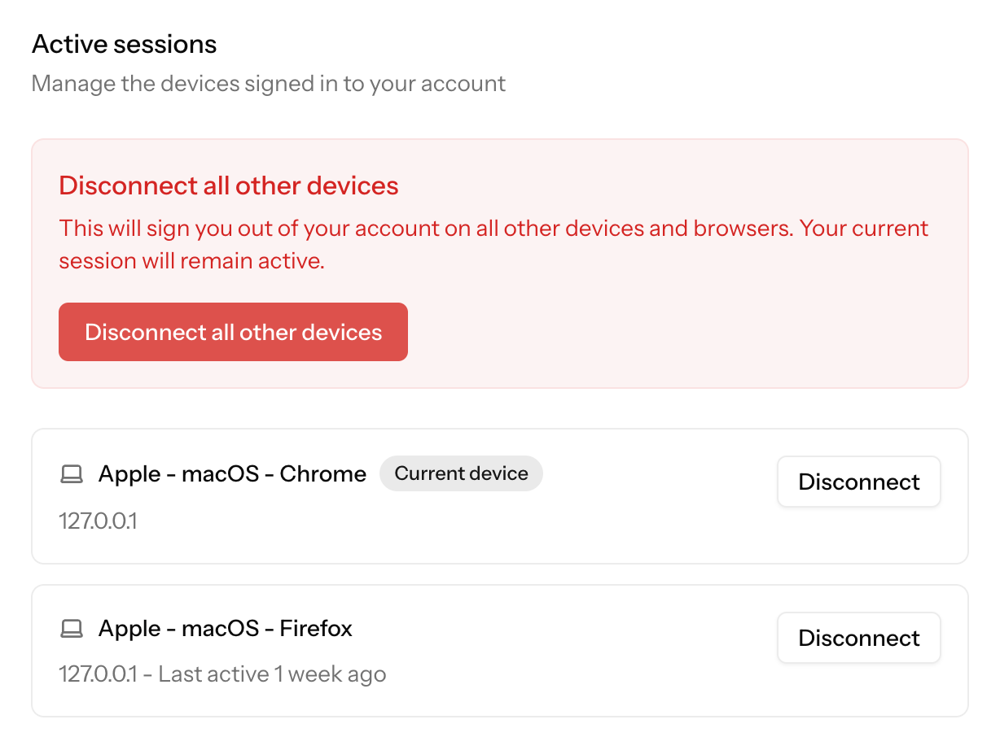
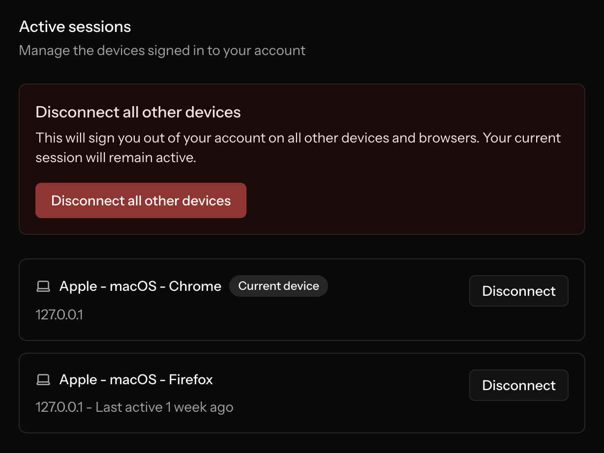
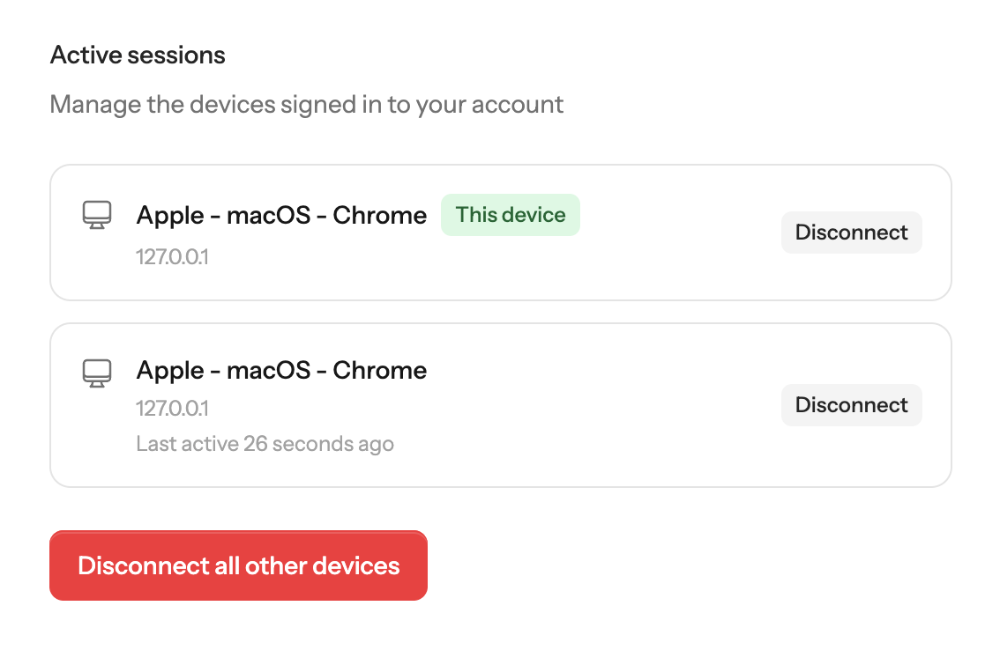
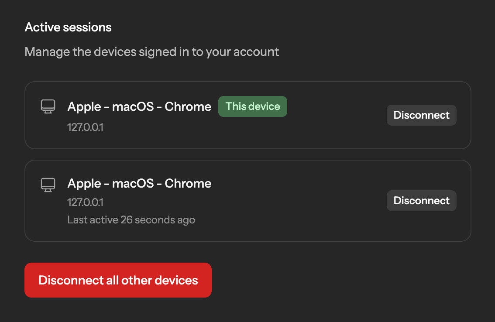
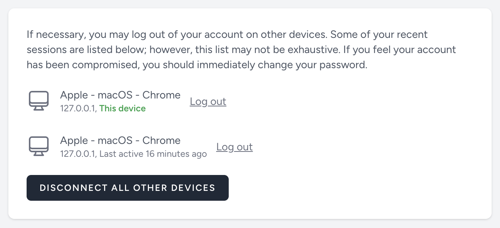
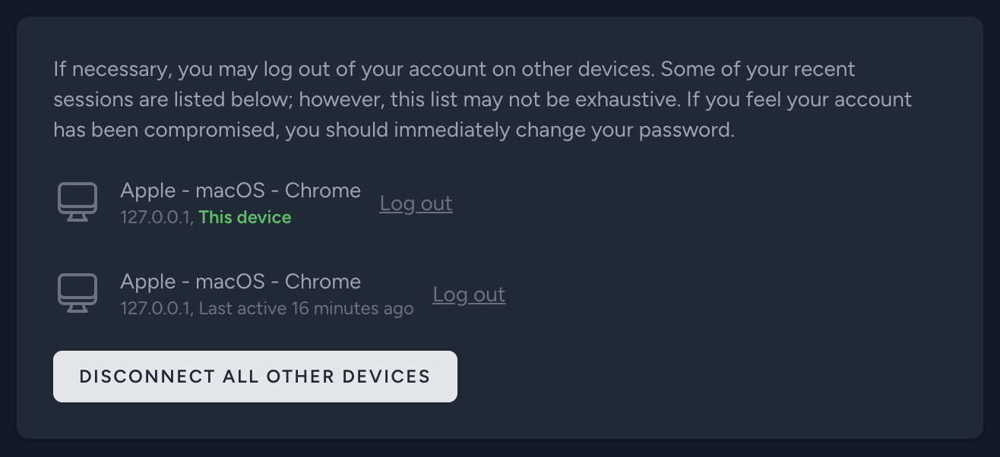

# Laravel Logins 🔑

- For each login, record information about the device (device type, device name, OS, browser, IP address) and the context (date and location)
- Display active sessions in the user's account so they can review connected devices
- Notify users by email whenever a new login occurs, including the collected information
- Allow users to sign out a specific device, all devices except the current one, or all devices at once
- Sign out a device without affecting other remembered devices (each remembered session has its own token)
- Optionally track Sanctum tokens, which is useful when authenticating mobile apps, for example


_____

* [Compatibility](#compatibility)
* [Installation](#installation)
  * [Prepare your authenticatable models](#prepare-your-authenticatable-models)
  * [Choose and install a user-agent parser](#choose-and-install-a-user-agent-parser)
  * [Configure the authentication guard](#configure-the-authentication-guard)
  * [Configure the user provider](#configure-the-user-provider)
  * [Laravel Sanctum](#laravel-sanctum)
* [UI components](#ui-components)
  * [Vue Starter Kit](#vue-starter-kit)
  * [Livewire Starter Kit](#livewire-starter-kit)
  * [Jetstream with Livewire](#jetstream-with-livewire)
* [Usage](#usage)
  * [Retrieving the logins](#retrieving-the-logins)
    * [Get all the logins](#get-all-the-logins)
    * [Get the current login](#get-the-current-login)
  * [Check for the current login](#check-for-the-current-login)
  * [Revoking logins](#revoking-logins)
    * [Revoke a specific login](#revoke-a-specific-login)
    * [Revoke all the logins](#revoke-all-the-logins)
    * [Revoke all the logins except the current one](#revoke-all-the-logins-except-the-current-one)
* [IP address geolocation](#ip-address-geolocation)
* [Events](#events)
  * [LoggedIn](#loggedin)
* [Notifications](#notifications)
  * [Temporarily disable notifications](#temporarily-disable-notifications)
* [Translations](#translations)
* [Purge expired logins](#purge-expired-logins)
* [GDPR and Privacy Considerations](#gdpr-and-privacy-considerations)
* [License](#license)

## Compatibility

- This package has been tested with Laravel v10 to v13

- It works with all the session drivers supported by Laravel, except the cookie driver (which saves the sessions only in
  the client browser) and the array driver

- It also supports personal access tokens provided by **Laravel Sanctum (v3)**

## Installation

Install the package with composer:

```bash
composer require alajusticia/laravel-logins
```

Publish the configuration file (`logins.php`) with:

```bash
php artisan vendor:publish --tag="logins-config"
```

Run the `logins:install` command to run the required database migrations:

```bash
php artisan logins:install
```

### Prepare your authenticatable models

In order to track the logins of your app's users, add the `ALajusticia\Logins\Traits\HasLogins` trait
in your authenticatable models that you want to track:

```php
use ALajusticia\Logins\Traits\HasLogins;
use Illuminate\Foundation\Auth\User as Authenticatable;
// ...

class User extends Authenticatable
{
    use HasLogins;

    // ...
}
```

### Choose and install a user-agent parser

This package relies on a user-agent parser to extract the information.

It supports the two most popular parsers:
- WhichBrowser ([https://github.com/WhichBrowser/Parser-PHP](https://github.com/WhichBrowser/Parser-PHP))
- Agent ([https://github.com/jenssegers/agent](https://github.com/jenssegers/agent)) ⚠️ This one doesn't work with Laravel > v10

Before using Laravel Logins, you need to choose a supported parser, install it and indicate in the configuration file 
which one you want to use.

### Configure the authentication guard

This package comes with a custom authentication guard (`ALajusticia\Logins\LoginsSessionGuard`) that extends the default
Laravel session guard, adding the logic to delete related logins in the `logout()`, `logoutCurrentDevice()` and
`logoutOtherDevices()` methods.

In the `guards` options of your `auth.php` configuration file, use the `logins` driver instead of the `session` driver:

```php
'guards' => [
    'web' => [
        'driver' => 'logins',
        'provider' => 'users',
    ],
    
    // ...
],
```

### Configure the user provider

This package comes with a modified Eloquent user provider that retrieves remembered users from the logins table,
allowing each session to have its own remember token and giving us the ability to revoke sessions individually.

When using Laravel Logins, you DON'T need to use the `Illuminate\Session\Middleware\AuthenticateSession` middleware for
the "Logout other devices" feature to work. Each login having its own remember token, we don't have to rehash the user
password or to add overhead to check the password hash at every request using the AuthenticateSession middleware.

In your `auth.php` configuration file, use the `logins` driver in the user providers list for the users you want to enable logins:

```php
'providers' => [
    'users' => [
        'driver' => 'logins',
        'model' => env('AUTH_MODEL', User::class),
    ],
    
    // ...
],
```

### Laravel Sanctum

In addition to sessions, Laravel Logins also supports tracking personal access tokens issued by Laravel Sanctum 
(go to [Compatibility](#compatibility) section for information on supported versions).

This feature can be useful if you are authenticating users from external apps, like mobile apps for example.

> ℹ️ You don't need to enable this if you only track stateful Sanctum authentications (like with Inertia.js).

To enable it, set `sanctum_token_tracking` to `true` in your `logins.php` configuration file.
If Laravel Sanctum is installed after you've installed Laravel Logins, you will have to run the `logins:install` 
command again to update your installation.

When Sanctum tracking is enabled, the `LoggedIn` event is dispatched everytime a token is issued. Also, logins related
to tokens are listed and managed the same way we manage sessions. This implies that, when calling `logoutAll()` method
for example, all sessions AND all personal access tokens will be deleted. This may not be the behavior you want if you
have mixed use cases, and you're also issuing Sanctum personal access tokens for other separated purposes, like API
access. If so, you can define a regular expression in `sanctum_token_name_regex` option of your `logins.php`
configuration file, and only the tokens whose name matches the defined pattern will be tracked as "logins":

```php
'sanctum_token_name_regex' => '/^mobile_app_/',
```

## UI components

Logins also includes ready-to-use UI components.

These optional add-ons are designed for projects using the official Laravel starter kits.
They provide a working setup out of the box, without requiring you to build your own components.

The following Laravel starter kits are supported (more coming):

- [Laravel Vue Starter Kit](https://laravel.com/docs/12.x/starter-kits#vue)
- [Laravel Livewire Starter Kit](https://laravel.com/docs/12.x/starter-kits#livewire)
- [Laravel Jetstream with Livewire](https://jetstream.laravel.com/introduction.html#livewire-blade)

If you want to use the UI component, you can publish it running this command:

```bash
php artisan logins:publish
```

Options:
- Use `--starter-kit=vue`, `--starter-kit=livewire-single-file`, `--starter-kit=livewire-class-based`, or `--starter-kit=jetstream-livewire` to skip the prompt.
- Use `--force` to overwrite an existing published component.

The `logins:publish` command asks which starter kit you want to target and publishes the reusable `Active Sessions` component for that stack.

In the latest version of the Laravel starter kits, there is a "Security" page in the user settings area: this is the perfect place to put the `Active Sessions` component.

The published Livewire components include their own backend logic.

For the Vue component, Laravel Logins includes API endpoints providing the backend logic.

### Vue Starter Kit

| Light                                                                                                   | Dark                                                                                                        |
|---------------------------------------------------------------------------------------------------------|-------------------------------------------------------------------------------------------------------------|
|  |  |

1. Run `php artisan logins:publish` and select `Laravel Vue Starter Kit`.

The command will published this file:

```text
resources/js/components/Logins.vue
```

2. Register the built-in routes in the `boot` method of a service provider (for example in `app/Providers/AppServiceProvider.php`):

```php
use ALajusticia\Logins\Logins;

public function boot(): void
{
    Logins::registerRoutes();
}
```

The following endpoints will be registered and protected behind the `auth` middleware:

```text
GET api/logins
DELETE api/logins/all
DELETE api/logins/others
DELETE api/logins/{loginId}
```

These routes will be used by the published `Logins.vue` component.

3. Import and use the `Logins.vue` component:

```vue
<script setup lang="ts">
import Logins from '@/components/Logins.vue';
</script>

<template>
    <Logins />
</template>
```

### Livewire Starter Kit

| Light                                                                                                        | Dark                                                                                                |
|--------------------------------------------------------------------------------------------------------------|-----------------------------------------------------------------------------------------------------|
|  |  |

Publishing the UI component for Livewire copies the reusable component files in your project. The command asks whether you want the single-file or class-based variant:

- **Single-file variant**:
  - `resources/views/livewire/logins.blade.php`
- **Class-based variant**:
  - `app/Livewire/Logins.php`
  - `resources/views/livewire/logins.blade.php`

Render the published component wherever it makes sense in your application.

You can, for example, add it at the bottom of the security settings page:

```blade
<livewire:logins class="mt-12" />
```

### Jetstream with Livewire

If you're using the previous Livewire starter kit (Laravel Jetstream), you can stop using the `AuthenticateSession` middleware, as it is not necessary with Logins.

In your `jetstream.php` configuration file, set `auth_session` to `null`:

```php
'auth_session' => null,
```

In your routes, remove the middleware:

```diff
Route::middleware([
    'auth:sanctum',
-    config('jetstream.auth_session'),
    'verified',
])->group(function () {
    // ...
});
```

Run the `logins:publish` command and select `Laravel Jetstream with Livewire`.
This will publish this component:

| Light                                                                                                                  | Dark                                                                                                          |
|------------------------------------------------------------------------------------------------------------------------|---------------------------------------------------------------------------------------------------------------|
|  |  |

Files will be copied in `app/Livewire/Logins.php` and `resources/views/livewire/logins.blade.php`.

To use the component, replace the `LogoutOtherBrowserSessionsForm` component of Jetstream, in the profile page
(`resources/views/profile/show.blade.php`) view, by the `Logins` component:

```diff
<div class="mt-10 sm:mt-0">
-    @livewire('profile.logout-other-browser-sessions-form')
+    @livewire('logins')
</div>
```

Feel free to modify the component to suit your needs.

## Usage

The `ALajusticia\Logins\Traits\HasLogins` trait provides your authenticatable models with methods to retrieve and manage
the user's logins.

Everytime a new successful login occurs or a Sanctum token is created, information about the request will automatically
be saved in the database in the `logins` table.

Also, if a notification class is defined in the `logins.php` configuration file, a notification will be sent to your
user with the information.

### Retrieving the logins

#### Get all the logins

```php
$logins = request()->user()->logins;
```

#### Get the current login

```php
$currentLogin = request()->user()->current_login;
```

### Check for the current login

Each login instance comes with a dynamic `is_current` attribute.

It's a boolean that indicates if the login instance corresponds to the login related to the current session or current
personal access token used.

### Revoking logins

#### Revoke a specific login

Using our custom user provider, you have the ability to log out a specific device, because each session has its own 
remember token.

To revoke a specific login, use the `logout` method with the ID of the login you want to revoke. 
If no parameter is given, the current login will be revoked.

```php
request()->user()->logout(1); // Revoke the login where id=1
```

```php
request()->user()->logout(); // Revoke the current login
```

#### Revoke all the logins

We can destroy all the sessions and revoke all the Sanctum tokens by using the `logoutAll` method. 

This feature destroys all sessions, even the remembered ones.

```php
request()->user()->logoutAll();
```

#### Revoke all the logins except the current one

The `logoutOthers` method acts in the same way as the `logoutAll` method, except that it keeps the current
session or Sanctum token alive.

```php
request()->user()->logoutOthers();
```

## IP address geolocation

In addition to the information extracted from the user-agent, you can collect information about the location, based on
the client's IP address.

To use this feature, you have to install and configure this package: [https://github.com/stevebauman/location](https://github.com/stevebauman/location).
Then, enable IP address geolocation in the `logins.php` configuration file.

By default, this is how the client's IP address is determined:

```php
// Support Cloudflare proxy by checking if HTTP_CF_CONNECTING_IP header exists
// Fallback to built-in Laravel ip() method in Request

return $_SERVER['HTTP_CF_CONNECTING_IP'] ?? request()->ip();
```

You can define your own IP address resolution logic, by passing a closure to the `getIpAddressUsing()` static method of
the `ALajusticia\Logins\Logins` class, and returning the resolved IP address.

Call it in the `boot()` method of a service provider, for example in your `App\Providers\AppServiceProvider`:

```php
\ALajusticia\Logins\Logins::getIpAddressUsing(function () {
    return request()->ip();
});
```

## Events

### LoggedIn

On a new login, you can listen to the `ALajusticia\Logins\Events\LoggedIn` event.

It receives the authenticated model (in `$authenticatable` property) and the `ALajusticia\Logins\RequestContext` object
(in `$context` property) containing all the information collected about the request:

```php
use ALajusticia\Logins\Events\LoggedIn;
use Illuminate\Support\Facades\Event;

Event::listen(function (LoggedIn $event) {
    
    // Methods available in RequestContext:
    $event->context->date(); // Returns the date of the login (Carbon object)
    $event->context->userAgent(); // Returns the full, unparsed, User-Agent header
    $event->context->ipAddress(); // Returns the client's IP address
    $event->context->parser(); // Returns the parser used to parse the User-Agent header
    $event->context->location(); // Returns the location (Stevebauman\Location\Position object), if IP address geolocation enabled
    $event->context->tokenName(); // Returns the personal access token name (if Sanctum stateless authentication)
    
    // Methods available in the parser:
    $this->context->parser()->getDevice(); // The name of the device
    $this->context->parser()->getDeviceType(); // The type of the device (desktop, mobile, tablet or phone)
    $this->context->parser()->getPlatform(); // The name of the platform/OS
    $this->context->parser()->getBrowser(); // The name of the browser
})
```

## Notifications

If you want to send a notification to your users when new access to their account occurs, pass a notification class
to the `new_login_notification` option in the `logins.php` configuration file.

Laravel Logins comes with a ready-to-use notification (`ALajusticia\Logins\Notifications\NewLogin`),
or you can use your own.

### Temporarily disable notifications

If you want to disable notifications for a user for the current request, you can set the `notifyLogins` public property
(from the `HasLogins` trait) of your authenticatable model to `false` before logging in the user:

```
$user->notifyLogins = false;

Auth::login($user);
```

## Translations

This package includes translations for English, Spanish and French.

If you want to customize the translations or add new ones, you can publish the language files by running this command:

```bash
php artisan vendor:publish --tag="logins-lang"
```

## Purge expired logins

This packages uses [Laravel Expirable](https://github.com/alajusticia/laravel-expirable) to make the Login model
expirable.

To purge expired logins, you can add the `ALajusticia\Logins\Models\Login` class to the `purge` array of the
`expirable.php` configuration file:

```php
    'purge' => [
        \ALajusticia\Logins\Models\Login::class,
    ],
```

## GDPR and Privacy Considerations

Laravel Logins helps applications track and manage authentication sessions so users can review and terminate access from other devices. Because this functionality involves storing session metadata, it is important to consider both **security** and **privacy** aspects when using this package.

### Stored Information

Depending on your configuration and implementation, the package may store authentication metadata such as:

- User identifier
- IP address
- Browser / device information (user agent)
- Login timestamp
- Last activity timestamp

This information is used solely to allow users to **review their active sessions and revoke access from other devices**.

Some of these elements (such as IP addresses or device information) may be considered **personal data** under privacy regulations such as the **General Data Protection Regulation (GDPR)**.

### Responsibility

This package provides only the technical functionality required to manage login sessions.  
The **application integrating this package is responsible for ensuring compliance** with applicable privacy laws and regulations.

Laravel Logins **does not collect or transmit data externally**. All data is stored locally within your application's database.

### Privacy Best Practices

If you use this package in a production environment, especially within jurisdictions governed by privacy regulations (such as the EU), consider applying the following best practices:

- **Inform users** in your Privacy Policy that login session information may be recorded for security purposes.
- **Limit retention** of old session records and periodically remove outdated entries.
- **Delete related session records** when a user account is deleted.
- **Restrict database access** to authorized services only.

Tracking login sessions can typically be justified under the **legitimate interest of protecting user accounts and preventing unauthorized access**.

### Security Benefits

The features provided by Laravel Logins contribute to account security by allowing users to:

- View recent login activity
- Identify unknown devices or sessions
- Revoke access from other devices

These capabilities help users detect suspicious activity and protect their accounts.

### Disclosure of Security Issues

If you discover a security vulnerability within this package, please report it responsibly by opening a private security advisory on GitHub or contacting the maintainer.

Please **do not disclose security vulnerabilities publicly until they have been addressed**.

### Legal Disclaimer

This package provides technical tools only and does not constitute legal advice.  
Developers integrating this package should consult appropriate legal guidance to ensure their applications comply with applicable privacy regulations.

## License

Open source, licensed under the [MIT license](LICENSE).
